# Chapter 1: Introduction to Agents on Apps

> **[Open the Workshop Presentation](../docs/agents-on-apps-workshop.html)** -- Interactive slide deck to follow along with this workshop.

## What is an "Agent on an App"?

An **Agent on an App** is an AI agent deployed as a Databricks App. Instead of deploying your agent behind a Model Serving endpoint, you deploy it as a full application that:

- Runs as a **FastAPI server** with the MLflow `AgentServer`
- Includes a **built-in chat UI** (or can serve a custom frontend)
- Supports **local development** with hot-reload, so you iterate fast on your laptop
- Deploys to **Databricks Apps** with a single CLI command
- Gets **automatic tracing** via MLflow for observability and debugging
- Supports **on-behalf-of (OBO) authentication** so users interact with Databricks resources using their own credentials

This is the recommended approach for building and deploying agents on Databricks. See the [official Agent Framework documentation](https://docs.databricks.com/aws/en/generative-ai/agent-framework/author-agent) for the full reference.

## Architecture Overview

<p align="center">
  
</p>

## Key Components

### 1. MLflow AgentServer

The `AgentServer` from `mlflow.genai.agent_server` is the backbone. It:

- Wraps your agent code in a FastAPI application
- Exposes a `/invocations` endpoint that accepts the [OpenAI Responses API](https://platform.openai.com/docs/api-reference/responses) format
- Handles both streaming and non-streaming responses
- Automatically traces all agent interactions to MLflow
- Optionally serves a chat UI via `enable_chat_proxy=True`

### 2. The `@invoke()` and `@stream()` Decorators

These decorators register your agent functions with the AgentServer:

```python
from mlflow.genai.agent_server import invoke, stream

@invoke()
async def non_streaming(request: ResponsesAgentRequest) -> ResponsesAgentResponse:
    """Called for non-streaming requests"""
    ...

@stream()
async def streaming(request: ResponsesAgentRequest) -> AsyncGenerator[ResponsesAgentStreamEvent, None]:
    """Called for streaming requests - yields events as they happen"""
    ...
```

### 3. LangGraph + LangChain

[LangGraph](https://langchain-ai.github.io/langgraph/) is a framework for building stateful, multi-step agents. Combined with LangChain, it provides:

- **Agent orchestration**: The agent decides which tools to call and when
- **Tool integration**: Easily add Python functions as tools via `@tool`
- **MCP support**: Connect to MCP servers for pre-built tool catalogs
- **Streaming**: Native support for streaming token-by-token responses

### 4. Databricks Foundation Models

Your agent uses Databricks-hosted LLMs via the `ChatDatabricks` class:

```python
from databricks_langchain import ChatDatabricks

model = ChatDatabricks(endpoint="databricks-claude-sonnet-4-5")
```

This works both locally (using your Databricks CLI credentials) and when deployed (using the app's service principal).

### 5. MCP (Model Context Protocol) Servers

MCP is an open protocol that lets your agent connect to external tool servers. Databricks provides built-in MCP servers for:

- **SQL**: Query SQL warehouses
- **Vector Search**: Search vector indexes
- **Genie**: Natural language data exploration
- **UC Functions**: Call Unity Catalog functions

You can also build and connect to custom MCP servers.

## Project Structure

Every agent app in this workshop follows this structure:

```
my-agent/
├── app.yaml                 # Databricks App deployment config
├── pyproject.toml           # Python dependencies and entry points
├── .env.example             # Environment variable template
├── .env.local               # Your local environment (git-ignored)
├── agent_server/
│   ├── __init__.py
│   ├── agent.py             # Your agent logic (this is where you code)
│   ├── start_server.py      # AgentServer initialization (rarely modified)
│   └── utils.py             # Helper functions
```

### `app.yaml` - Deployment Configuration

Tells Databricks how to run your app:

```yaml
command: ["uv", "run", "start-app"]

env:
  - name: MLFLOW_TRACKING_URI
    value: "databricks"
  - name: MLFLOW_EXPERIMENT_ID
    valueFrom: "experiment"    # Bound from Databricks App resources
```

### `pyproject.toml` - Dependencies and Scripts

Manages Python packages and defines entry points:

```toml
[project.scripts]
start-app = "scripts.start_app:main"             # Start backend + chat UI
start-server = "agent_server.start_server:main"   # Start backend only
agent-evaluate = "agent_server.evaluate_agent:evaluate"  # Run offline evaluation
```

### `agent.py` - Your Agent

This is where you spend most of your time. It defines:

1. What **model** your agent uses
2. What **tools** your agent has access to
3. How **requests are processed** (the `@invoke` and `@stream` functions)

### `evaluate_agent.py` - Offline Evaluation

Runs test prompts through your agent and scores the results using [MLflow evaluation](https://docs.databricks.com/aws/en/mlflow3/genai/eval-monitor/). Run with `uv run agent-evaluate`. This is not part of the running server -- it's a separate tool for testing agent quality before deploying.

### `start_server.py` - Server Bootstrap

Initializes the AgentServer. You rarely need to modify this:

```python
from dotenv import load_dotenv
from mlflow.genai.agent_server import AgentServer

load_dotenv(dotenv_path=".env.local", override=True)

import agent_server.agent  # Register @invoke/@stream decorators

agent_server = AgentServer("ResponsesAgent", enable_chat_proxy=True)
app = agent_server.app
```

## Authentication: Resource Auth vs User API Scopes

When your agent runs as a Databricks App, there are **two distinct ways** it can authenticate to access Databricks resources. Understanding when to use each is critical. See the [Agent Framework authentication docs](https://docs.databricks.com/aws/en/generative-ai/agent-framework/agent-authentication) and the [Databricks Apps auth docs](https://docs.databricks.com/aws/en/dev-tools/databricks-apps/auth) for the full reference.

<p align="center">
  
</p>

### App Service Principal (Resource Auth)

Every Databricks App gets a dedicated **service principal (SP)** that acts as its identity. When you declare resources in `databricks.yml` or via the App UI, you grant this SP specific permissions:

```yaml
# databricks.yml
resources:
  apps:
    my_agent:
      resources:
        - name: llm
          serving_endpoint:
            name: databricks-claude-sonnet-4-5
            permission: CAN_QUERY       # SP can call this endpoint
        - name: experiment
          experiment:
            experiment_name: /Users/me/my-exp
            permission: CAN_MANAGE      # SP can write traces here
```

In your Python code, the SP auth happens automatically:

```python
from databricks.sdk import WorkspaceClient

# This uses the app's service principal credentials automatically
# (DATABRICKS_CLIENT_ID / DATABRICKS_CLIENT_SECRET env vars are injected)
workspace_client = WorkspaceClient()
```

**Use SP auth when:**
- All users should see the same data/results
- Background tasks, logging, monitoring
- Accessing shared resources (LLM endpoints, MLflow experiments)
- Simpler setup -- no OAuth configuration needed

**Limitation:** Every user sees the same data. Unity Catalog row/column filters are **not** applied because the SP is making the request, not the individual user.

### User API Scopes (On-Behalf-Of / OBO)

With user API scopes, the app accesses Databricks APIs **as the logged-in user**. Databricks forwards the user's OAuth token to your app via the `x-forwarded-access-token` HTTP header.

You declare which scopes the app needs in `databricks.yml`:

```yaml
# databricks.yml
resources:
  apps:
    my_agent:
      user_api_scopes:
        - sql                          # Query SQL warehouses as user
        - serving.serving-endpoints    # Call endpoints as user
        - dashboards.genie             # Access Genie spaces as user
        - catalog.catalogs:read        # Read UC catalogs as user
        - catalog.schemas:read         # Read UC schemas as user
        - catalog.tables:read          # Read UC tables as user
```

In your Python code, you extract the user's token from request headers:

```python
from databricks.sdk import WorkspaceClient
from mlflow.genai.agent_server import get_request_headers

def get_user_workspace_client() -> WorkspaceClient:
    """Authenticate as the requesting user (OBO)."""
    token = get_request_headers().get("x-forwarded-access-token")
    return WorkspaceClient(token=token, auth_type="pat")

# Now API calls use the user's identity and permissions
user_client = get_user_workspace_client()
```

**Use OBO auth when:**
- Different users should see different data (row/column filters apply)
- Compliance requires per-user audit trails
- Users have different permissions on tables, warehouses, etc.
- Fine-grained access control is required

### Comparison

| Aspect | Service Principal (Resource Auth) | User API Scopes (OBO) |
|--------|-----------------------------------|----------------------|
| **Identity** | App's service principal | Logged-in user |
| **Configuration** | `resources:` with `permission:` | `user_api_scopes:` list |
| **Code pattern** | `WorkspaceClient()` (automatic) | `WorkspaceClient(token=header_token)` |
| **Unity Catalog filters** | Not applied | Applied per user |
| **Audit logs** | Logged as service principal | Logged as individual user |
| **Setup complexity** | Simple -- grant SP permissions | Requires OAuth scopes, user consent |
| **Use case** | Shared resources, background tasks | User-specific data access |

### Using Both Together

Most production agents use **both** approaches. The service principal handles shared resources while OBO handles user-specific data:

<p align="center">
  
</p>

> **Blue nodes** = Service Principal auth (shared). **Green nodes** = User token / OBO (per-user permissions).

```python
# SP auth for shared resources (LLM, MLflow)
sp_client = WorkspaceClient()  # Automatic SP credentials

# OBO auth for user-specific resources (tables, warehouses)
def get_user_client():
    token = get_request_headers().get("x-forwarded-access-token")
    return WorkspaceClient(token=token, auth_type="pat")
```

For example:
- **SP auth** calls the LLM serving endpoint (all users use the same model)
- **OBO auth** queries a SQL warehouse (each user sees only their permitted data)

### Available User API Scopes

| Scope | What it grants |
|-------|---------------|
| `sql` | Query SQL warehouses |
| `serving.serving-endpoints` | List and query model serving endpoints |
| `dashboards.genie` | Access Genie spaces |
| `files.files` | Manage files and directories |
| `catalog.catalogs:read` | Read Unity Catalog catalogs |
| `catalog.schemas:read` | Read Unity Catalog schemas |
| `catalog.tables:read` | Read Unity Catalog tables |
| `catalog.connections` | Access Unity Catalog connections |
| `vectorsearch.vector-search-indexes` | Access vector search indexes |
| `vectorsearch.vector-search-endpoints` | Access vector search endpoints |

Two scopes are always included by default: `iam.access-control:read` and `iam.current-user:read`.

### Local Development Note

When running locally, there is no `x-forwarded-access-token` header. The `get_user_workspace_client()` helper should fall back to default credentials:

```python
import os
from databricks.sdk import WorkspaceClient
from mlflow.genai.agent_server import get_request_headers

def get_user_workspace_client() -> WorkspaceClient:
    """Get a workspace client -- OBO in Databricks Apps, default locally."""
    if "DATABRICKS_APP_NAME" in os.environ:
        token = get_request_headers().get("x-forwarded-access-token")
        return WorkspaceClient(token=token, auth_type="pat")
    else:
        return WorkspaceClient()  # Uses CLI/env auth locally
```

## Development Workflow

<p align="center">
  
</p>

### Local Development

```bash
# 1. Authenticate with Databricks
databricks auth login

# 2. Set up environment
cp .env.example .env.local
# Edit .env.local with your MLflow experiment ID

# 3. Install dependencies
uv sync

# 4. Run locally with chat UI
uv run start-app
# Open http://localhost:8000

# 5. Or run just the backend with hot-reload
uv run start-server --reload
```

### Testing via API

```bash
# Streaming
curl -X POST http://localhost:8000/invocations \
  -H "Content-Type: application/json" \
  -d '{ "input": [{ "role": "user", "content": "hello" }], "stream": true }'

# Non-streaming
curl -X POST http://localhost:8000/invocations \
  -H "Content-Type: application/json" \
  -d '{ "input": [{ "role": "user", "content": "hello" }] }'
```

## Deployment Methods

This workshop covers three ways to deploy your agent to Databricks Apps. Each method is demonstrated in the chapter deployment steps.

### 1. Deploy from Workspace UI

The Databricks workspace UI provides a visual, click-through deployment experience. Navigate to **Compute > Apps > Create App**, configure your app name and source code path, add resources (MLflow experiments, serving endpoints, databases) via the form, and click **Deploy**.

**Best for:** First-time users, quick exploration, one-off deployments.

### 2. Deploy from CLI

The Databricks CLI lets you create and deploy apps with a few commands. You create the app, sync your source code to the workspace, add resources via the UI, and deploy:

```bash
databricks apps create my-agent
DATABRICKS_USERNAME=$(databricks current-user me | jq -r .userName)
databricks sync . "/Users/$DATABRICKS_USERNAME/my-agent"
databricks apps deploy my-agent \
  --source-code-path /Workspace/Users/$DATABRICKS_USERNAME/my-agent
```

**Best for:** Scripted workflows, rapid iteration during development, CI pipelines.

### 3. Deploy from Automation Bundles

Databricks Automation Bundles let you define your entire deployment -- the app, resources, permissions, and environment configuration -- in a single `databricks.yml` file. One command does everything:

```bash
databricks bundle deploy
```

**Best for:** Production deployments, team collaboration, multi-environment (dev/staging/prod).

### 4. Deploy from Python SDK

The Databricks Python SDK provides full programmatic control over the app lifecycle via `WorkspaceClient().apps`. Create, deploy, update, stop, and delete apps entirely in Python:

```python
from databricks.sdk import WorkspaceClient
from databricks.sdk.service.apps import App, AppDeployment

w = WorkspaceClient()
w.apps.create_and_wait(App(name="my-agent", resources=[...]))
w.apps.deploy_and_wait("my-agent", AppDeployment(source_code_path="..."))
```

**Best for:** CI/CD pipelines, notebook-based deployment, dynamic provisioning, integration testing.

### Comparison

| Method | Config File | Commands | Resource Management | Best For |
|--------|-------------|----------|---------------------|----------|
| **Workspace UI** | None | Click-through | Visual form | Exploration |
| **CLI** | `app.yaml` | 3 commands | Manual in UI | Development |
| **Automation Bundles** | `databricks.yml` | 1 command | Declarative in YAML | Production |
| **Python SDK** | Python code | Python script | Python objects | CI/CD, automation |

> **Note:** Deployed apps require **OAuth tokens** (not PATs) for API access. Use `databricks auth token` to get one.

## Reference

- [Author an Agent (Clone from GitHub)](https://docs.databricks.com/aws/en/generative-ai/agent-framework/author-agent) -- Official getting started guide
- [Agent Framework Authentication](https://docs.databricks.com/aws/en/generative-ai/agent-framework/agent-authentication) -- SP auth vs user auth for deployed agents
- [Databricks Apps Auth](https://docs.databricks.com/aws/en/dev-tools/databricks-apps/auth) -- OBO tokens, user API scopes, security best practices
- [Agent Framework Tools](https://docs.databricks.com/aws/en/generative-ai/agent-framework/agent-tool) -- Adding tools, MCP servers, UC functions, vector search
- [Databricks Apps Deploy](https://docs.databricks.com/aws/en/dev-tools/databricks-apps/deploy) -- Deploying apps via CLI
- [Databricks Apps Resources](https://docs.databricks.com/aws/en/dev-tools/databricks-apps/resources) -- Configuring app resources and permissions
- [Databricks Apps MLflow](https://docs.databricks.com/aws/en/dev-tools/databricks-apps/mlflow) -- Linking MLflow experiments to apps
- [MLflow ResponsesAgent](https://mlflow.org/docs/latest/genai/flavors/responses-agent-intro/) -- Input/output formats, tracing, agent authoring
- [Databricks App Templates (GitHub)](https://github.com/databricks/app-templates) -- Official template repository

## What's Next

In [Chapter 2](../02-hello-agent/), you'll build your first agent with custom Python tools and test it locally.
