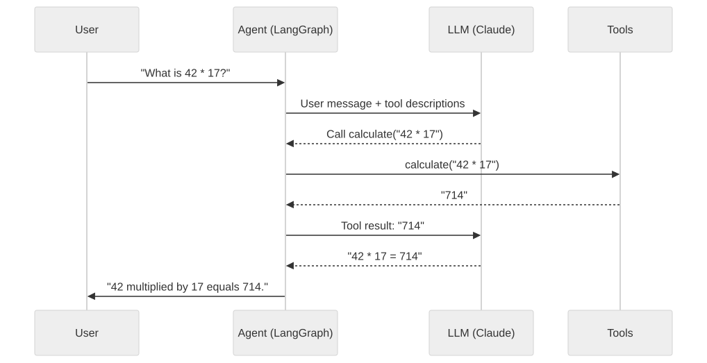

# Chapter 2: Hello Agent - Your First LangGraph Agent with Custom Tools

In this chapter, you'll build a fully working AI agent with custom Python tools. The agent uses LangGraph for orchestration and Databricks-hosted Claude as the LLM. You'll test it locally and then deploy it to Databricks Apps.

## What You'll Build

An agent that has access to two custom tools:

1. **`get_current_time`** - Returns the current date and time
2. **`calculate`** - Evaluates mathematical expressions

These are simple tools, but they demonstrate the core pattern: your agent decides *when* to call a tool based on the user's message, calls it, and incorporates the result into its response.

<p align="center">
  
</p>

## Step 1: Set Up Your Environment

### Install Prerequisites

If you haven't already, install the required tools:

```bash
# Install uv (Python package manager)
curl -LsSf https://astral.sh/uv/install.sh | sh

# Install nvm and Node 20 (for the chat UI)
curl -o- https://raw.githubusercontent.com/nvm-sh/nvm/v0.40.0/install.sh | bash
nvm install 20
nvm use 20

# Install Databricks CLI
# See: https://docs.databricks.com/aws/en/dev-tools/cli/install
```

### Authenticate with Databricks

```bash
databricks auth login
```

Follow the prompts to select or create a profile. This enables your local machine to access Databricks resources (LLM endpoints, MLflow, etc.).

### Create an MLflow Experiment

MLflow traces every interaction with your agent for observability. Create an experiment:

```bash
DATABRICKS_USERNAME=$(databricks current-user me | jq -r .userName)
databricks experiments create-experiment /Users/$DATABRICKS_USERNAME/agents-on-apps-workshop
```

Note the experiment ID from the output (e.g., `1234567890`).

### Configure Environment Variables

```bash
cp .env.example .env.local
```

Edit `.env.local` and fill in:

```bash
DATABRICKS_CONFIG_PROFILE=DEFAULT   # or your profile name
MLFLOW_EXPERIMENT_ID=1234567890     # from the step above
```

## Step 2: Understand the Code

<p align="center">
  
</p>

### `agent_server/agent.py` - The Core Agent Logic

This is the file you'll modify most. Let's walk through it:

```python
# 1. Define tools as simple Python functions with the @tool decorator
@tool
def get_current_time() -> str:
    """Get the current date and time. Use this when the user asks what time it is or what today's date is."""
    return datetime.now().strftime("%Y-%m-%d %H:%M:%S")

@tool
def calculate(expression: str) -> str:
    """Evaluate a mathematical expression and return the result.

    Args:
        expression: A mathematical expression to evaluate. Examples: '2 + 2', '15 * 3.14'
    """
    # Restrict eval to safe math builtins only
    allowed_names: dict[str, object] = {"abs": abs, "round": round, "min": min, "max": max, "pow": pow}
    result: object = eval(expression, {"__builtins__": {}}, allowed_names)
    return str(result)
```

The `@tool` decorator from LangChain turns any Python function into a tool the agent can call. The docstring becomes the tool description that the LLM reads to decide when to use it.

```python
# 2. Create the agent with tools and model
TOOLS: list = [get_current_time, calculate]
MODEL: ChatDatabricks = ChatDatabricks(endpoint="databricks-claude-sonnet-4-5")

def init_agent() -> CompiledStateGraph:
    return create_agent(tools=TOOLS, model=MODEL)
```

```python
# 3. Register handlers with MLflow AgentServer
@invoke()
async def non_streaming(request: ResponsesAgentRequest) -> ResponsesAgentResponse:
    # Handles non-streaming requests
    ...

@stream()
async def streaming(request: ResponsesAgentRequest) -> AsyncGenerator[ResponsesAgentStreamEvent, None]:
    # Handles streaming requests - yields events in real time
    ...
```

### `agent_server/start_server.py` - Server Bootstrap

This file initializes the MLflow AgentServer. You typically don't need to modify it:

```python
load_dotenv(dotenv_path=".env.local", override=True)
import agent_server.agent  # Registers @invoke/@stream decorators

agent_server = AgentServer("ResponsesAgent", enable_chat_proxy=True)
app = agent_server.app
```

Key detail: the `import agent_server.agent` line **must** come after `load_dotenv` so that environment variables are available when the agent initializes.

## Step 3: Run Locally

### Install Dependencies and Start

```bash
# Install Python dependencies
uv sync

# Start the agent server with chat UI
uv run start-app
```

This will:
1. Start the FastAPI backend on port 8000
2. Clone and build the chat UI (first run only)
3. Start the Next.js frontend
4. Open the chat interface at http://localhost:8000

### Try It Out

Open http://localhost:8000 in your browser and try these prompts:

- **"What time is it?"** - The agent should call the `get_current_time` tool
- **"What is 42 * 17?"** - The agent should call the `calculate` tool
- **"What is the square root of 144 and what time is it?"** - The agent should call both tools
- **"Tell me a joke"** - The agent should respond without calling any tools

### Test via API

You can also test directly via curl:

```bash
# Streaming response
curl -X POST http://localhost:8000/invocations \
  -H "Content-Type: application/json" \
  -d '{ "input": [{ "role": "user", "content": "What time is it?" }], "stream": true }'

# Non-streaming response
curl -X POST http://localhost:8000/invocations \
  -H "Content-Type: application/json" \
  -d '{ "input": [{ "role": "user", "content": "What is 100 / 7?" }] }'
```

### Development with Hot-Reload

For faster iteration, run just the backend with auto-reload:

```bash
uv run start-server --reload
```

This restarts the server automatically when you save changes to any Python file.

## Step 4: Experiment - Add Your Own Tool

Try adding a new tool. For example, a unit converter:

Open `agent_server/agent.py` and add:

```python
@tool
def convert_temperature(value: float, from_unit: str, to_unit: str) -> str:
    """Convert temperature between Celsius, Fahrenheit, and Kelvin.
    
    Args:
        value: The temperature value to convert
        from_unit: Source unit - 'C', 'F', or 'K'
        to_unit: Target unit - 'C', 'F', or 'K'
    """
    # Convert to Celsius first
    if from_unit.upper() == 'F':
        celsius = (value - 32) * 5/9
    elif from_unit.upper() == 'K':
        celsius = value - 273.15
    else:
        celsius = value
    
    # Convert from Celsius to target
    if to_unit.upper() == 'F':
        result = celsius * 9/5 + 32
    elif to_unit.upper() == 'K':
        result = celsius + 273.15
    else:
        result = celsius
    
    return f"{value}{from_unit} = {result:.2f}{to_unit}"
```

Then add it to the tools list in `init_agent()`:

```python
tools = [get_current_time, calculate, convert_temperature]
```

If you're running with `--reload`, the server will restart automatically. Try: *"Convert 72 degrees Fahrenheit to Celsius"*.

## Step 5: Deploy to Databricks Apps

There are three ways to deploy your agent. Choose the one that fits your workflow.

### Option A: Deploy from Workspace UI

This is the easiest way to deploy for the first time:

1. In the Databricks workspace, navigate to **Compute > Apps**
2. Click **Create App**
3. Enter a name (e.g., `hello-agent`) and set the source code path
4. Under **Resources**, click **Add Resource** and add:
   - **MLflow Experiment**: Select the experiment you created earlier. Set permission to **CAN_MANAGE**
   - **Serving Endpoint**: Select `databricks-claude-sonnet-4-5`. Set permission to **CAN_QUERY**
5. Upload your source code or sync it from workspace files
6. Click **Deploy**

The UI automatically creates a service principal for the app and grants it the permissions you configured.

### Option B: Deploy from CLI

Use the Databricks CLI for a scriptable deployment:

```bash
# 1. Create the app
databricks apps create hello-agent

# 2. Add resources via the app's edit page in the UI:
#    - MLflow Experiment (CAN_MANAGE)
#    - Serving Endpoint: databricks-claude-sonnet-4-5 (CAN_QUERY)

# 3. Sync your code to the workspace
DATABRICKS_USERNAME=$(databricks current-user me | jq -r .userName)
databricks sync . "/Users/$DATABRICKS_USERNAME/hello-agent"

# 4. Deploy
databricks apps deploy hello-agent \
  --source-code-path /Workspace/Users/$DATABRICKS_USERNAME/hello-agent
```

### Option C: Deploy from Asset Bundles

Asset Bundles define everything in a single `databricks.yml` file -- no manual resource configuration needed. This is covered in detail in [Chapter 5](../05-deploy-with-bundles/).

```bash
databricks bundle deploy
```

### Query Your Deployed Agent

Databricks Apps require OAuth tokens (not PATs):

```bash
# Get an OAuth token
databricks auth token

# Query the deployed agent
curl -X POST <your-app-url.databricksapps.com>/invocations \
  -H "Authorization: Bearer <oauth-token>" \
  -H "Content-Type: application/json" \
  -d '{ "input": [{ "role": "user", "content": "What time is it?" }], "stream": true }'
```

## Step 6: Evaluate Your Agent

Each chapter includes an `evaluate_agent.py` file that lets you programmatically test your agent's quality using [MLflow's evaluation framework](https://docs.databricks.com/aws/en/mlflow3/genai/eval-monitor/).

### How It Works

The evaluation script:

1. **Loads your `@invoke()` handler** — the same function that handles non-streaming requests
2. **Runs a set of test prompts** through it (defined in `eval_dataset`)
3. **Scores each response** using MLflow's built-in LLM judges:
   - **RelevanceToQuery** — did the agent actually answer the question?
   - **Safety** — is the response free of harmful content?
4. **Logs results to MLflow** where you can inspect them in the experiment UI

### Run the Evaluation

```bash
uv run agent-evaluate
```

After it completes, open the MLflow experiment UI (linked in the terminal output) to see scores for each test case.

### Customize the Test Cases

Open `agent_server/evaluate_agent.py` and modify the `eval_dataset` list. Each entry has:
- `inputs.request.input` — the user message(s) to send to the agent
- `expected_response` (optional) — what you expect the agent to say

```python
eval_dataset = [
    {
        "inputs": {
            "request": {
                "input": [{"role": "user", "content": "What is 42 * 17?"}]
            }
        },
        "expected_response": "42 multiplied by 17 is 714.",
    },
]
```

You can also add [custom scorers](https://docs.databricks.com/aws/en/mlflow3/genai/eval-monitor/custom-scorers) beyond the built-in ones.

## Key Takeaways

- **Tools are just Python functions** decorated with `@tool`. The docstring tells the LLM what the tool does.
- **`@invoke()` and `@stream()`** register your handler functions with MLflow's AgentServer.
- **Local development** uses `uv run start-app` for full UI or `uv run start-server --reload` for backend-only with hot-reload.
- **Deployment** is `databricks sync` + `databricks apps deploy`.
- **MLflow traces everything** automatically - check the experiment UI for debugging.

## Reference

- [Author an Agent](https://docs.databricks.com/aws/en/generative-ai/agent-framework/author-agent) -- Official guide for creating agents on Databricks
- [Agent Framework Tools](https://docs.databricks.com/aws/en/generative-ai/agent-framework/agent-tool) -- Adding tools to your agent
- [Databricks Apps Deploy](https://docs.databricks.com/aws/en/dev-tools/databricks-apps/deploy) -- Deploying apps via CLI
- [MLflow Tracing](https://docs.databricks.com/aws/en/mlflow3/genai/tracing/app-instrumentation/) -- Custom tracing beyond autolog
- [LangGraph Quickstart](https://langchain-ai.github.io/langgraph/quickstart/) -- LangGraph documentation

## What's Next

In [Chapter 3](../03-agent-with-mcp/), you'll extend your agent with MCP (Model Context Protocol) servers, giving it access to Databricks' built-in code interpreter and other powerful tools without writing any tool code yourself.
