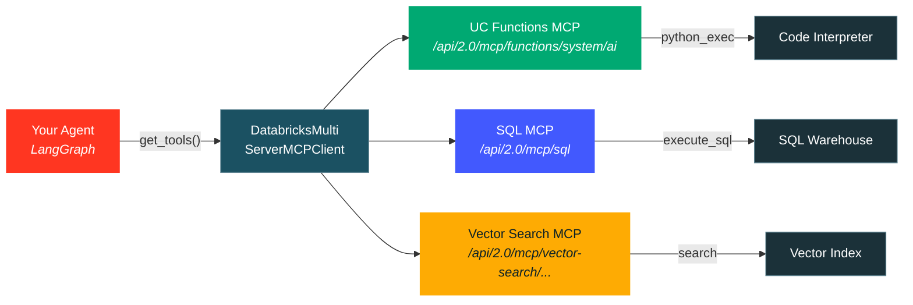
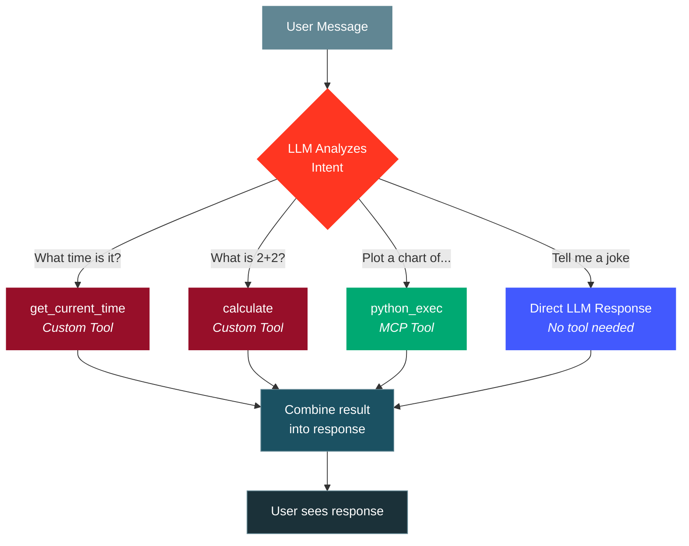

# Chapter 3: Adding MCP Server Tools to Your Agent

In this chapter, you'll extend your agent with **MCP (Model Context Protocol)** servers. Instead of writing tool functions by hand, you'll connect to Databricks' built-in MCP servers that provide powerful, pre-built tools -- including a **Python code interpreter** that every Databricks workspace has access to.

## What is MCP?

[MCP (Model Context Protocol)](https://modelcontextprotocol.io/) is an open protocol that standardizes how AI agents discover and use tools. Think of it like a USB port for AI tools -- any MCP-compatible server can plug into any MCP-compatible agent.



Databricks provides several built-in MCP servers:

| MCP Server | URL Pattern | What It Does |
|------------|-------------|--------------|
| **SQL** | `/api/2.0/mcp/sql` | Query SQL warehouses with natural language |
| **Vector Search** | `/api/2.0/mcp/vector-search/{catalog}/{schema}` | Search vector indexes |
| **Genie** | `/api/2.0/mcp/genie/{space_id}` | Natural language data exploration |
| **UC Functions** | `/api/2.0/mcp/functions/{catalog}/{schema}` | Call Unity Catalog functions |

In this chapter, we'll use the **UC Functions** MCP server pointing at the `system.ai` catalog/schema, which every Databricks workspace has access to. It gives your agent a built-in Python code interpreter (`python_exec`) -- the agent can write and execute Python code to answer complex questions.

## What You'll Build

An agent that combines:
1. **Custom tools** (from Chapter 2) - `get_current_time` and `calculate`
2. **MCP tools** from the `system.ai` UC functions - primarily `python_exec` for code execution

This means your agent can answer simple questions with its custom tools, and tackle complex tasks (data analysis, chart generation, etc.) by writing and executing Python code.

## What Changed from Chapter 2

The key differences from Chapter 2 are:

### 1. New dependency: `langchain-mcp-adapters`

In `pyproject.toml`, we added:
```toml
"langchain-mcp-adapters>=0.1.11",
```

This package lets LangChain agents use tools from MCP servers.

### 2. MCP client initialization in `agent.py`

```python
from databricks_langchain import DatabricksMCPServer, DatabricksMultiServerMCPClient

def init_mcp_client() -> DatabricksMultiServerMCPClient:
    host_name = get_databricks_host_from_env()
    return DatabricksMultiServerMCPClient([
        DatabricksMCPServer(
            name="system-ai",
            url=f"{host_name}/api/2.0/mcp/functions/system/ai",
        ),
    ])
```

### 3. Tools are loaded dynamically from MCP + custom tools

```python
async def init_agent():
    mcp_client = init_mcp_client()
    mcp_tools = await mcp_client.get_tools()
    all_tools = CUSTOM_TOOLS + mcp_tools  # Combine custom + MCP tools
    return create_agent(tools=all_tools, model=MODEL)
```

## Step 1: Set Up Your Environment

If you completed Chapter 2, you can reuse your existing authentication and MLflow experiment. Otherwise, follow the setup steps from [Chapter 2](../02-hello-agent/README.md#step-1-set-up-your-environment).

```bash
cd 03-agent-with-mcp
cp .env.example .env.local
# Edit .env.local with your DATABRICKS_CONFIG_PROFILE and MLFLOW_EXPERIMENT_ID
```

## Step 2: Understand the Code

### `agent_server/agent.py` - The Key Changes

The agent now initializes an MCP client that connects to Databricks' `system.ai` server:

```python
def init_mcp_client() -> DatabricksMultiServerMCPClient:
    """Connect to Databricks MCP servers to discover available tools."""
    host_name = get_databricks_host_from_env()
    return DatabricksMultiServerMCPClient([
        DatabricksMCPServer(
            name="system-ai",
            url=f"{host_name}/api/2.0/mcp/functions/system/ai",
        ),
        # Add more MCP servers here as needed:
        # DatabricksMCPServer(
        #     name="sql",
        #     url=f"{host_name}/api/2.0/mcp/sql?warehouse_id=YOUR_WAREHOUSE_ID",
        # ),
    ])
```

At startup, `mcp_client.get_tools()` calls the MCP server to discover what tools are available and converts them into LangChain-compatible tool objects. These are then combined with your custom tools.

### How the Agent Decides Which Tool to Use

When a user sends a message, the LLM sees descriptions of ALL available tools (both custom and MCP). It decides:

- **Simple math?** Use the `calculate` custom tool
- **What time is it?** Use the `get_current_time` custom tool
- **Complex analysis, data manipulation, or code?** Use `python_exec` from the MCP server



## Step 3: Run Locally

```bash
uv sync
uv run start-app
```

Open http://localhost:8000 and try these prompts:

### Custom Tool Prompts (Same as Chapter 2)
- "What time is it?"
- "What is 42 * 17?"

### MCP Code Interpreter Prompts (New!)
- **"Write a Python function to check if a number is prime, then test it with 97"**
- **"Generate a list of the first 20 Fibonacci numbers"**
- **"Create a simple bar chart of the top 5 programming languages by popularity"**
- **"Calculate the standard deviation of these numbers: 4, 8, 15, 16, 23, 42"**

The agent will write Python code, execute it via the `python_exec` MCP tool, and return the results.

### Observe the Difference

Notice that for complex tasks, the agent now:
1. Writes Python code
2. Sends it to the `python_exec` tool (via MCP)
3. Gets the execution result
4. Incorporates the result into its response

This is much more powerful than the simple `calculate` tool from Chapter 2.

## Step 4: Adding More MCP Servers

You can connect to multiple MCP servers. Here are examples:

### SQL Warehouse (for querying data)

```python
DatabricksMCPServer(
    name="sql",
    url=f"{host_name}/api/2.0/mcp/sql?warehouse_id=YOUR_WAREHOUSE_ID",
),
```

### Unity Catalog Functions (for custom functions)

```python
DatabricksMCPServer(
    name="my-functions",
    url=f"{host_name}/api/2.0/mcp/functions/my_catalog/my_schema",
),
```

### Vector Search (for RAG)

```python
DatabricksMCPServer(
    name="vector-search",
    url=f"{host_name}/api/2.0/mcp/vector-search/my_catalog/my_schema",
),
```

Each MCP server you add gives your agent access to its entire tool catalog automatically.

## Step 5: Deploy to Databricks Apps

Deployment is the same as Chapter 2:

```bash
# Create the app (if not already created)
databricks apps create agent-with-mcp

# Add resources via the app's edit page:
# - MLflow Experiment
# - Serving Endpoint (for the LLM model)

# Sync and deploy
DATABRICKS_USERNAME=$(databricks current-user me | jq -r .userName)
databricks sync . "/Users/$DATABRICKS_USERNAME/agent-with-mcp"
databricks apps deploy agent-with-mcp \
  --source-code-path /Workspace/Users/$DATABRICKS_USERNAME/agent-with-mcp
```

### Important: MCP Server Authentication

When deployed to Databricks Apps, the MCP client automatically authenticates using the app's service principal. The `system.ai` MCP server is available to all workspace users by default, so no additional permissions are needed.

For other MCP servers (SQL, Vector Search, etc.), you'll need to grant the app's service principal access to the underlying resources (warehouses, indexes, etc.).

## Key Takeaways

- **MCP servers provide tools without writing code** - just connect to a server and your agent gets its entire tool catalog
- **`DatabricksMultiServerMCPClient`** connects to multiple MCP servers and merges all their tools
- **`system.ai`** is available in every workspace and provides a Python code interpreter
- **Custom tools and MCP tools work together** - combine them to give your agent exactly the capabilities it needs
- **Adding new MCP servers is one line of config** - no agent logic changes required

## What's Next

You now have a solid foundation for building agents on Databricks Apps. From here, you can:

- Add more MCP servers for SQL, Vector Search, or Genie
- Build custom MCP servers with FastMCP for your own APIs
- Add on-behalf-of (OBO) authentication for user-scoped access
- Create evaluation datasets to systematically test your agent
- Deploy to production with proper resource permissions
