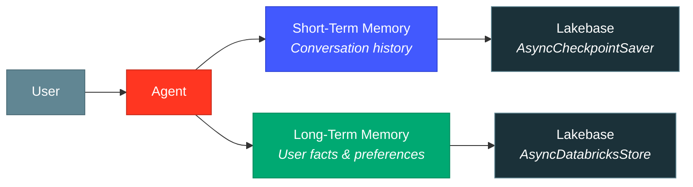
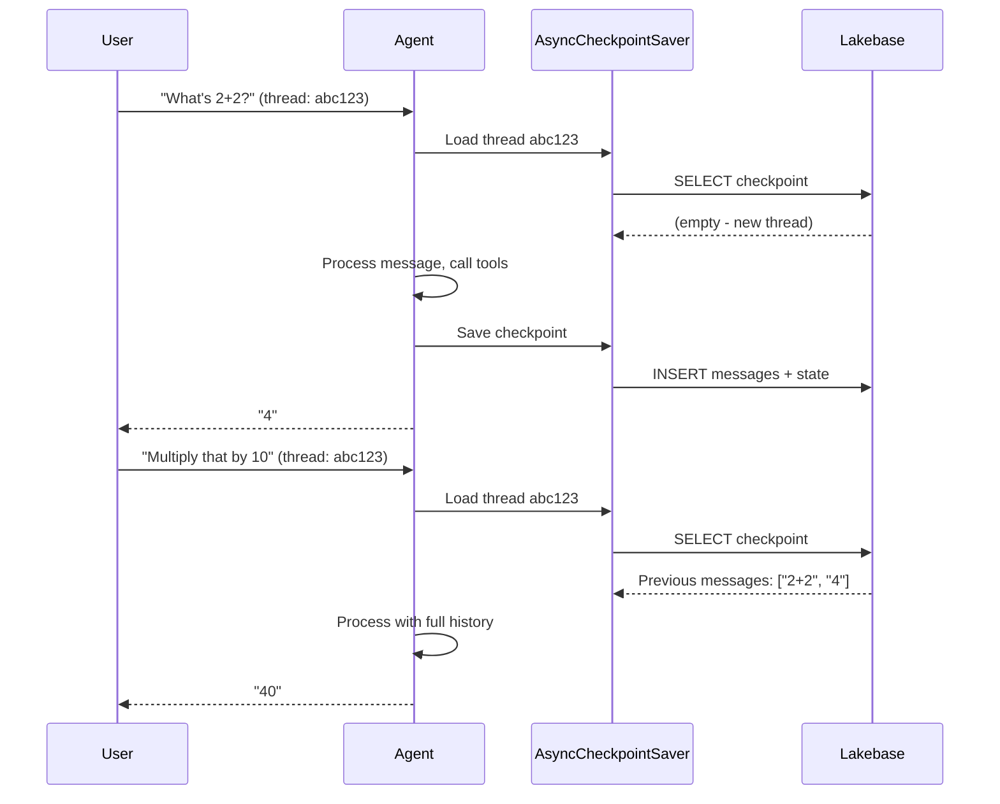
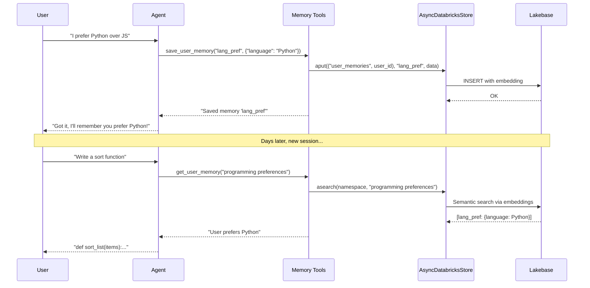

# Chapter 5: Short-Term and Long-Term Memory

In previous chapters, our agent was **stateless** -- every request was independent, with no memory of prior conversations. In this chapter, you'll add both **short-term memory** (conversation history within a session) and **long-term memory** (facts that persist across sessions and users).

Both types use [Lakebase](https://docs.databricks.com/aws/en/lakebase/), Databricks' fully-managed Postgres database, as the storage backend. See the [Stateful Agents documentation](https://docs.databricks.com/aws/en/generative-ai/agent-framework/stateful-agents) for the full reference.

## What Are Short-Term and Long-Term Memory?



### Short-Term Memory (Conversation History)

Short-term memory lets your agent remember **what was said earlier in the current conversation**. Without it, every message is processed in isolation -- the agent has no idea what you asked 30 seconds ago.

**How it works:**
- Each conversation gets a **thread ID**
- LangGraph's `AsyncCheckpointSaver` stores the full message history for each thread in Lakebase
- On each new message, the agent loads the existing thread history and appends to it
- The chat UI sends the thread ID automatically so messages in the same session share context

**Example:** "What's the weather?" followed by "What about tomorrow?" -- with short-term memory, the agent knows "tomorrow" refers to the same location.

### Long-Term Memory (Cross-Session Knowledge)

Long-term memory lets your agent remember **facts about users across conversations**. Even if a user starts a new chat session days later, the agent can recall their preferences, role, and other persistent details.

**How it works:**
- The agent has tools (`get_user_memory`, `save_user_memory`, `delete_user_memory`) to read/write a per-user knowledge store
- `AsyncDatabricksStore` persists memories in Lakebase with **semantic search** (embeddings via `databricks-gte-large-en`)
- Memories are stored per user, keyed by user ID
- The agent's system prompt instructs it when to proactively save and retrieve memories

**Example:** "I prefer Python over JavaScript" -- saved to memory. Next week: "Write me a function to sort a list" -- the agent remembers to use Python.

## Prerequisites

Both memory types require a **Lakebase instance**. You can use either:

- **Provisioned Lakebase** -- a dedicated instance you create
- **Autoscaling Lakebase** -- a shared, serverless instance (project + branch)

To create a provisioned Lakebase instance:

```bash
databricks lakebase create-database-instance <instance-name> --capacity CU_1
```

Or use the Databricks UI: **SQL** > **Lakebase** > **Create instance**.

## Part A: Short-Term Memory

### What Changed from Chapter 3

| Component | Chapter 3 (Stateless) | Chapter 5 (Short-Term Memory) |
|-----------|----------------------|-------------------------------|
| **Dependency** | `databricks-langchain` | `databricks-langchain[memory]` |
| **Agent state** | Default | Custom `StatefulAgentState` with `add_messages` |
| **Checkpointer** | None | `AsyncCheckpointSaver` backed by Lakebase |
| **Thread ID** | Not used | Extracted from request or auto-generated |
| **Agent config** | `{}` | `{"configurable": {"thread_id": thread_id}}` |

### Key Code: `agent.py`

The agent now uses a `StatefulAgentState` that accumulates messages, and an `AsyncCheckpointSaver` that persists them to Lakebase:

```python
from databricks_langchain import AsyncCheckpointSaver, ChatDatabricks
from langgraph.graph.message import add_messages

class StatefulAgentState(TypedDict, total=False):
    messages: Annotated[Sequence[AnyMessage], add_messages]
    custom_inputs: dict[str, Any]
    custom_outputs: dict[str, Any]
```

The `add_messages` annotation tells LangGraph to **append** new messages to the existing list rather than replacing it. This is what makes conversation history work.

The agent is created with a checkpointer:

```python
async def init_agent(checkpointer=None):
    tools = [get_current_time, calculate]
    model = ChatDatabricks(endpoint="databricks-claude-sonnet-4-5")
    return create_agent(
        model=model,
        tools=tools,
        system_prompt="You are a helpful assistant.",
        checkpointer=checkpointer,
        state_schema=StatefulAgentState,
    )
```

And the stream handler opens a checkpointer connection for each request:

```python
@stream()
async def stream_handler(request):
    thread_id = _get_or_create_thread_id(request)

    async with AsyncCheckpointSaver(
        instance_name=LAKEBASE_INSTANCE_NAME,
    ) as checkpointer:
        await checkpointer.setup()
        agent = await init_agent(checkpointer=checkpointer)

        config = {"configurable": {"thread_id": thread_id}}
        input_state = {
            "messages": to_chat_completions_input([...]),
            "custom_inputs": dict(request.custom_inputs or {}),
        }

        async for event in process_agent_astream_events(
            agent.astream(input_state, config, stream_mode=["updates", "messages"])
        ):
            yield event
```



### Thread ID Resolution

Thread IDs come from (in priority order):

1. `custom_inputs.thread_id` in the request
2. `context.conversation_id` from MLflow ChatContext
3. Auto-generated UUID (new conversation)

The chat UI automatically manages thread IDs -- messages in the same session share a thread.

## Part B: Long-Term Memory

### What Changed from Short-Term Memory

| Component | Short-Term Only | + Long-Term Memory |
|-----------|----------------|-------------------|
| **Store** | `AsyncCheckpointSaver` | + `AsyncDatabricksStore` |
| **Embedding** | Not needed | `databricks-gte-large-en` (1024 dims) |
| **Memory tools** | None | `get_user_memory`, `save_user_memory`, `delete_user_memory` |
| **User ID** | Not needed | Required for per-user memory |
| **System prompt** | Basic | Includes memory usage instructions |

### Key Code: Memory Tools (`utils_memory.py`)

The agent gets three tools for managing long-term memory:

```python
@tool
async def get_user_memory(query: str, config: RunnableConfig) -> str:
    """Search for relevant information about the user from long-term memory."""
    user_id = config.get("configurable", {}).get("user_id")
    store = config.get("configurable", {}).get("store")
    namespace = ("user_memories", user_id)
    results = await store.asearch(namespace, query=query, limit=5)
    return format_results(results)

@tool
async def save_user_memory(memory_key: str, memory_data_json: str, config: RunnableConfig) -> str:
    """Save information about the user to long-term memory."""
    user_id = config.get("configurable", {}).get("user_id")
    store = config.get("configurable", {}).get("store")
    namespace = ("user_memories", user_id)
    await store.aput(namespace, memory_key, json.loads(memory_data_json))
    return f"Saved memory '{memory_key}'"

@tool
async def delete_user_memory(memory_key: str, config: RunnableConfig) -> str:
    """Delete a specific memory from the user's long-term memory."""
    store = config.get("configurable", {}).get("store")
    namespace = ("user_memories", user_id)
    await store.adelete(namespace, memory_key)
    return f"Deleted memory '{memory_key}'"
```

The `AsyncDatabricksStore` uses **semantic search** -- when the agent calls `get_user_memory("programming language preference")`, it finds relevant memories even if they were stored with different wording.

### Key Code: `agent.py` with Long-Term Memory

The agent is initialized with a store and includes memory tools:

```python
from databricks_langchain import AsyncDatabricksStore

async def init_agent(store):
    tools = [get_current_time, calculate] + memory_tools()
    return create_agent(
        model=ChatDatabricks(endpoint="databricks-claude-sonnet-4-5"),
        tools=tools,
        system_prompt=SYSTEM_PROMPT,
        store=store,
    )
```

The stream handler creates the store and passes the user ID:

```python
@stream()
async def stream_handler(request):
    user_id = get_user_id(request)

    async with AsyncDatabricksStore(
        instance_name=LAKEBASE_INSTANCE_NAME,
        embedding_endpoint="databricks-gte-large-en",
        embedding_dims=1024,
    ) as store:
        await store.setup()
        config = {"configurable": {"store": store, "user_id": user_id}}
        agent = await init_agent(store=store)

        async for event in process_agent_astream_events(
            agent.astream(messages, config, stream_mode=["updates", "messages"])
        ):
            yield event
```



### System Prompt for Memory

The long-term memory agent's system prompt instructs it **when** to save and retrieve memories:

```python
SYSTEM_PROMPT = """You are a helpful assistant.

You have access to memory tools:
- Use get_user_memory to search for previously saved information about the user
- Use save_user_memory to remember important facts, preferences, or details
- Use delete_user_memory to forget specific information when asked

Always check for relevant memories at the start of a conversation.

**Always save** when the user explicitly asks you to remember something.
**Proactively save** preferences, role/expertise, ongoing projects, recurring constraints.
**Don't save** temporary facts, trivial details, or highly sensitive personal information."""
```

## Step 1: Set Up Lakebase

### Create a Lakebase Instance

```bash
databricks lakebase create-database-instance agent-memory --capacity CU_1
```

### Configure Environment

```bash
cd 05-agent-memory
cp .env.example .env.local
```

Edit `.env.local`:

```bash
DATABRICKS_CONFIG_PROFILE=DEFAULT
MLFLOW_EXPERIMENT_ID=<your-experiment-id>
LAKEBASE_INSTANCE_NAME=agent-memory    # your instance name
```

## Step 2: Run Locally

```bash
uv sync
uv run start-app
# Open http://localhost:8000
```

### Test Short-Term Memory

Try a multi-turn conversation:

1. "My name is Alice"
2. "What's my name?" -- agent should remember "Alice" from the thread history

### Test Long-Term Memory

1. "Remember that I prefer dark mode in all my applications"
2. Start a **new conversation** (new thread)
3. "What are my preferences?" -- agent should recall "dark mode" from long-term memory

## Step 3: Deploy

Deployment requires adding the Lakebase instance as an app resource:

```yaml
# In databricks.yml or via the App UI
resources:
  apps:
    memory_agent:
      resources:
        - name: lakebase
          database:
            database_name: databricks_postgres
            instance_name: agent-memory
            permission: CAN_CONNECT_AND_CREATE
```

Then grant the app's service principal access to Lakebase:

```sql
-- Connect to your Lakebase instance and run:
GRANT ALL ON DATABASE databricks_postgres TO "<app-service-principal-id>";
GRANT ALL ON SCHEMA public TO "<app-service-principal-id>";
ALTER DEFAULT PRIVILEGES IN SCHEMA public GRANT ALL ON TABLES TO "<app-service-principal-id>";
```

Deploy as usual:

```bash
databricks bundle deploy
```

## Step 4: Evaluate Your Agent

Run the evaluation to test your agent:

```bash
uv run agent-evaluate
```

Note that the default `eval_dataset` in `evaluate_agent.py` tests basic tool usage. For memory-specific testing, you'll want to add multi-turn test cases or manually test via the chat UI, since evaluation runs each prompt independently (no shared thread).

See [Chapter 2](../02-hello-agent/README.md#step-6-evaluate-your-agent) for a detailed explanation of how evaluation works.

## Key Takeaways

- **Short-term memory** uses `AsyncCheckpointSaver` to persist conversation history per thread ID in Lakebase
- **Long-term memory** uses `AsyncDatabricksStore` with semantic search to store/retrieve user facts across sessions
- Both require `databricks-langchain[memory]` and a Lakebase instance
- The `add_messages` annotation on agent state tells LangGraph to accumulate messages
- Memory tools (`get_user_memory`, `save_user_memory`, `delete_user_memory`) give the agent explicit control over what to remember
- The system prompt is critical for guiding when the agent should save vs. skip memories

## Reference

- [Stateful Agents](https://docs.databricks.com/aws/en/generative-ai/agent-framework/stateful-agents) -- Official docs for short and long-term memory
- [Lakebase](https://docs.databricks.com/aws/en/lakebase/) -- Managed Postgres for agent state
- [Short-Term Memory Template](https://github.com/databricks/app-templates/tree/main/agent-langgraph-short-term-memory) -- Official template
- [Long-Term Memory Template](https://github.com/databricks/app-templates/tree/main/agent-langgraph-long-term-memory) -- Official template
- [Author an Agent](https://docs.databricks.com/aws/en/generative-ai/agent-framework/author-agent) -- Getting started guide
- [LangGraph Persistence](https://langchain-ai.github.io/langgraph/concepts/persistence/) -- LangGraph checkpointer docs
