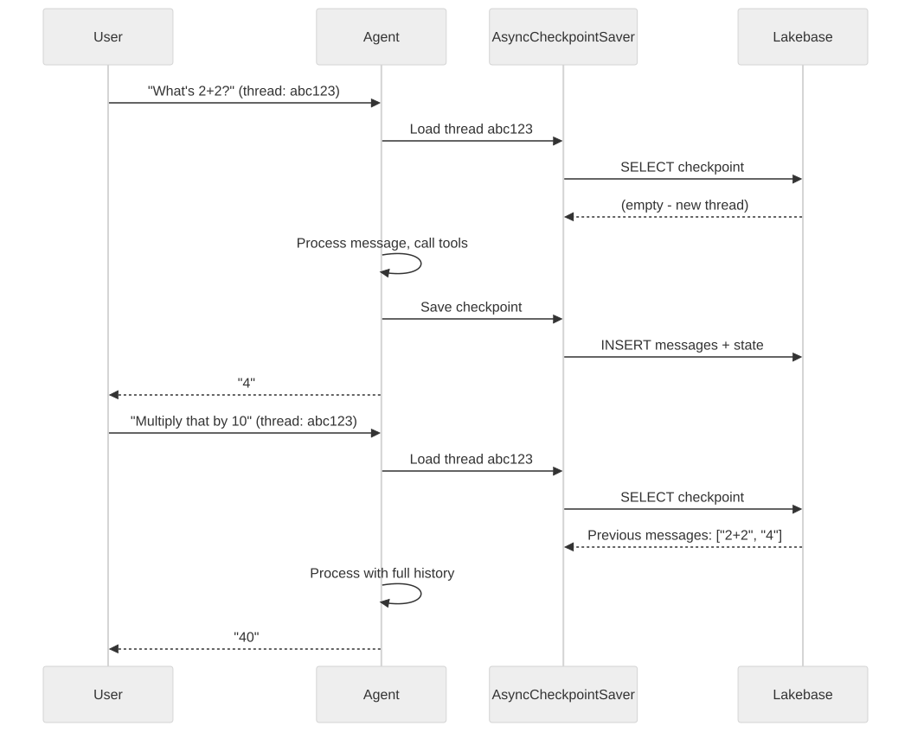
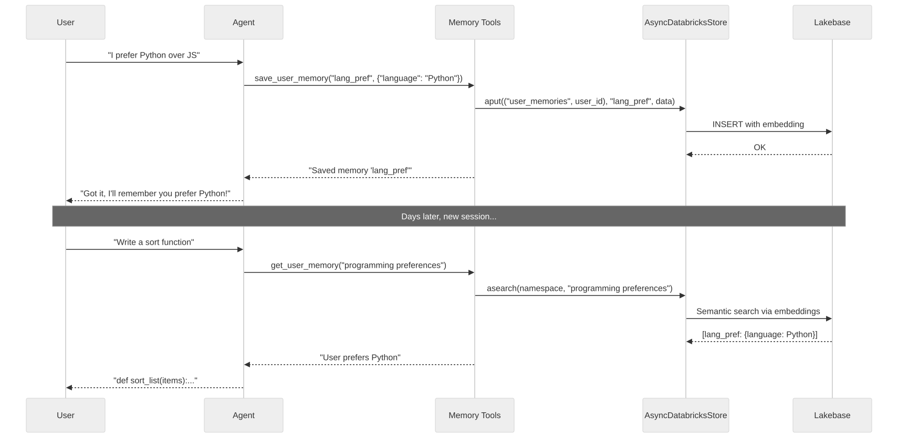

# Chapter 5: Short-Term and Long-Term Memory

In previous chapters, our agent was **stateless** -- every request was independent, with no memory of prior conversations. In this chapter, you'll add both **short-term memory** (conversation history within a session) and **long-term memory** (facts that persist across sessions and users).

Both types use [Lakebase](https://docs.databricks.com/aws/en/lakebase/), Databricks' fully-managed Postgres database, as the storage backend. See the [Stateful Agents documentation](https://docs.databricks.com/aws/en/generative-ai/agent-framework/stateful-agents) for the full reference.

## What Are Short-Term and Long-Term Memory?

<p align="center">
  
</p>

### Short-Term Memory (Conversation History)

Short-term memory lets your agent remember **what was said earlier in the current conversation**. Without it, every message is processed in isolation -- the agent has no idea what you asked 30 seconds ago.

**How it works:**
- Each conversation gets a **thread ID**
- LangGraph's `AsyncCheckpointSaver` stores the full message history for each thread in Lakebase
- On each new message, the agent loads the existing thread history and appends to it
- The chat UI sends the thread ID automatically so messages in the same session share context

**Example:** "What's the weather?" followed by "What about tomorrow?" -- with short-term memory, the agent knows "tomorrow" refers to the same location.

### Long-Term Memory (Cross-Session Knowledge)

Long-term memory lets your agent remember **facts about users across conversations**. Even if a user starts a new chat session days later, the agent can recall their preferences, role, and other persistent details.

**How it works:**
- The agent has tools (`get_user_memory`, `save_user_memory`, `delete_user_memory`) to read/write a per-user knowledge store
- `AsyncDatabricksStore` persists memories in Lakebase with **semantic search** (embeddings via `databricks-gte-large-en`)
- Memories are stored per user, keyed by user ID
- The agent's system prompt instructs it when to proactively save and retrieve memories

**Example:** "I prefer Python over JavaScript" -- saved to memory. Next week: "Write me a function to sort a list" -- the agent remembers to use Python.

## Prerequisites

Both memory types require a **Lakebase** database. Lakebase comes in two flavors:

- **Autoscaling Lakebase** (recommended) -- serverless, scales to zero, organized as projects + branches. This is the default for new instances.
- **Provisioned Lakebase** -- dedicated compute with fixed capacity.

The agent code supports both. You configure which one to use via environment variables (`LAKEBASE_PROJECT`/`LAKEBASE_BRANCH` for autoscaling, or `LAKEBASE_INSTANCE_NAME` for provisioned). See [Step 1](#step-1-set-up-lakebase) for setup instructions.

## Part A: Short-Term Memory

### What Changed from Chapter 3

| Component | Chapter 3 (Stateless) | Chapter 5 (Short-Term Memory) |
|-----------|----------------------|-------------------------------|
| **Dependency** | `databricks-langchain` | `databricks-langchain[memory]` |
| **Agent state** | Default | Custom `StatefulAgentState` with `add_messages` |
| **Checkpointer** | None | `AsyncCheckpointSaver` backed by Lakebase |
| **Thread ID** | Not used | Extracted from request or auto-generated |
| **Agent config** | `{}` | `{"configurable": {"thread_id": thread_id}}` |

### Key Code: `agent.py`

The agent now uses a `StatefulAgentState` that accumulates messages, and an `AsyncCheckpointSaver` that persists them to Lakebase:

```python
from databricks_langchain import AsyncCheckpointSaver, ChatDatabricks
from langgraph.graph.message import add_messages

class StatefulAgentState(TypedDict, total=False):
    messages: Annotated[Sequence[AnyMessage], add_messages]
    custom_inputs: dict[str, Any]
    custom_outputs: dict[str, Any]
```

The `add_messages` annotation tells LangGraph to **append** new messages to the existing list rather than replacing it. This is what makes conversation history work.

The agent is created with a checkpointer:

```python
async def init_agent(
    checkpointer: Optional[Any] = None,
    store: Optional[BaseStore] = None,
) -> CompiledStateGraph:
    tools: list = [get_current_time, calculate] + memory_tools()
    model: ChatDatabricks = ChatDatabricks(endpoint=LLM_ENDPOINT_NAME)
    return create_agent(
        model=model,
        tools=tools,
        system_prompt=SYSTEM_PROMPT,
        checkpointer=checkpointer,  # Short-term memory
        store=store,                # Long-term memory
        state_schema=StatefulAgentState,
    )
```

And the stream handler opens both memory connections for each request:

```python
@stream()
async def stream_handler(
    request: ResponsesAgentRequest,
) -> AsyncGenerator[ResponsesAgentStreamEvent, None]:
    thread_id: str = get_or_create_thread_id(request)
    user_id: Optional[str] = get_user_id(request)

    config: dict[str, Any] = {"configurable": {"thread_id": thread_id}}
    if user_id:
        config["configurable"]["user_id"] = user_id

    input_state: dict[str, Any] = {
        "messages": to_chat_completions_input([i.model_dump() for i in request.input]),
        "custom_inputs": dict(request.custom_inputs or {}),
    }

    # Open both short-term (checkpointer) and long-term (store) connections
    # Build connection kwargs — autoscaling uses project+branch, provisioned uses instance_name
    lakebase_kwargs = {}
    if LAKEBASE_PROJECT:
        lakebase_kwargs["project"] = LAKEBASE_PROJECT
        lakebase_kwargs["branch"] = LAKEBASE_BRANCH or "production"
    else:
        lakebase_kwargs["instance_name"] = LAKEBASE_INSTANCE_NAME

    async with AsyncCheckpointSaver(**lakebase_kwargs) as checkpointer:
        await checkpointer.setup()
        async with AsyncDatabricksStore(
            **lakebase_kwargs,
            embedding_endpoint=EMBEDDING_ENDPOINT,
            embedding_dims=EMBEDDING_DIMS,
        ) as store:
            await store.setup()
            config["configurable"]["store"] = store
            agent = await init_agent(checkpointer=checkpointer, store=store)

            async for event in process_agent_astream_events(
                agent.astream(input_state, config, stream_mode=["updates", "messages"])
            ):
                yield event
```

<p align="center">
  
</p>

### Thread ID Resolution

Thread IDs come from (in priority order):

1. `custom_inputs.thread_id` in the request
2. `context.conversation_id` from MLflow ChatContext
3. Auto-generated UUID (new conversation)

The chat UI automatically manages thread IDs -- messages in the same session share a thread.

## Part B: Long-Term Memory

### What Changed from Short-Term Memory

| Component | Short-Term Only | + Long-Term Memory |
|-----------|----------------|-------------------|
| **Store** | `AsyncCheckpointSaver` | + `AsyncDatabricksStore` |
| **Embedding** | Not needed | `databricks-gte-large-en` (1024 dims) |
| **Memory tools** | None | `get_user_memory`, `save_user_memory`, `delete_user_memory` |
| **User ID** | Not needed | Required for per-user memory |
| **System prompt** | Basic | Includes memory usage instructions |

### Key Code: Memory Tools (`utils_memory.py`)

The agent gets three tools for managing long-term memory:

```python
@tool
async def get_user_memory(query: str, config: RunnableConfig) -> str:
    """Search for relevant information about the user from long-term memory."""
    user_id: Optional[str] = config.get("configurable", {}).get("user_id")
    if not user_id:
        return "Memory not available - no user_id provided."
    store: Optional[BaseStore] = config.get("configurable", {}).get("store")
    if not store:
        return "Memory not available - store not configured."
    namespace: tuple[str, str] = ("user_memories", user_id.replace(".", "-"))
    results = await store.asearch(namespace, query=query, limit=5)
    if not results:
        return "No memories found for this user."
    memory_items: list[str] = [f"- [{item.key}]: {json.dumps(item.value)}" for item in results]
    return f"Found {len(results)} relevant memories:\n" + "\n".join(memory_items)

@tool
async def save_user_memory(memory_key: str, memory_data_json: str, config: RunnableConfig) -> str:
    """Save information about the user to long-term memory."""
    user_id: Optional[str] = config.get("configurable", {}).get("user_id")
    if not user_id:
        return "Cannot save memory - no user_id provided."
    store: Optional[BaseStore] = config.get("configurable", {}).get("store")
    if not store:
        return "Cannot save memory - store not configured."
    namespace: tuple[str, str] = ("user_memories", user_id.replace(".", "-"))
    memory_data: dict = json.loads(memory_data_json)
    await store.aput(namespace, memory_key, memory_data)
    return f"Successfully saved memory '{memory_key}' for user."

@tool
async def delete_user_memory(memory_key: str, config: RunnableConfig) -> str:
    """Delete a specific memory from the user's long-term memory."""
    user_id: Optional[str] = config.get("configurable", {}).get("user_id")
    if not user_id:
        return "Cannot delete memory - no user_id provided."
    store: Optional[BaseStore] = config.get("configurable", {}).get("store")
    if not store:
        return "Cannot delete memory - store not configured."
    namespace: tuple[str, str] = ("user_memories", user_id.replace(".", "-"))
    await store.adelete(namespace, memory_key)
    return f"Successfully deleted memory '{memory_key}' for user."
```

The `AsyncDatabricksStore` uses **semantic search** -- when the agent calls `get_user_memory("programming language preference")`, it finds relevant memories even if they were stored with different wording.

### Key Code: `agent.py` with Long-Term Memory

The agent is initialized with a store and includes memory tools. Note this is the same `init_agent()` shown in Part A -- it accepts both `checkpointer` and `store`:

```python
from databricks_langchain import AsyncDatabricksStore

async def init_agent(
    checkpointer: Optional[Any] = None,
    store: Optional[BaseStore] = None,
) -> CompiledStateGraph:
    tools: list = [get_current_time, calculate] + memory_tools()
    model: ChatDatabricks = ChatDatabricks(endpoint=LLM_ENDPOINT_NAME)
    return create_agent(
        model=model,
        tools=tools,
        system_prompt=SYSTEM_PROMPT,
        checkpointer=checkpointer,
        store=store,
        state_schema=StatefulAgentState,
    )
```

The stream handler creates both memory backends and passes the user ID via config. The actual code in `agent.py` nests both `AsyncCheckpointSaver` (short-term) and `AsyncDatabricksStore` (long-term) -- here we show the long-term store portion:

```python
@stream()
async def stream_handler(
    request: ResponsesAgentRequest,
) -> AsyncGenerator[ResponsesAgentStreamEvent, None]:
    user_id: Optional[str] = get_user_id(request)

    async with AsyncDatabricksStore(
        **lakebase_kwargs,  # Same project+branch or instance_name as checkpointer
        embedding_endpoint=EMBEDDING_ENDPOINT,
        embedding_dims=EMBEDDING_DIMS,
    ) as store:
        await store.setup()
        config: dict[str, Any] = {"configurable": {"store": store}}
        if user_id:
            config["configurable"]["user_id"] = user_id
        agent: CompiledStateGraph = await init_agent(store=store)

        async for event in process_agent_astream_events(
            agent.astream(messages, config, stream_mode=["updates", "messages"])
        ):
            yield event
```

<p align="center">
  
</p>

### System Prompt for Memory

The long-term memory agent's system prompt instructs it **when** to save and retrieve memories:

```python
SYSTEM_PROMPT = """You are a helpful assistant.

You have access to memory tools:
- Use get_user_memory to search for previously saved information about the user
- Use save_user_memory to remember important facts, preferences, or details
- Use delete_user_memory to forget specific information when asked

Always check for relevant memories at the start of a conversation.

**Always save** when the user explicitly asks you to remember something.
**Proactively save** preferences, role/expertise, ongoing projects, recurring constraints.
**Don't save** temporary facts, trivial details, or highly sensitive personal information."""
```

## Step 1: Set Up Lakebase

### Create a Lakebase Project

You can create a Lakebase project from the Databricks UI or via the Python SDK:

**From the UI:** Navigate to **SQL** > **Lakebase** > **Create project**.

**From the SDK:**

```python
from databricks.sdk import WorkspaceClient
from databricks.sdk.service.postgres import Project, ProjectSpec

w = WorkspaceClient()
w.postgres.create_project(project=Project(spec=ProjectSpec()), project_id="my-agent-memory")
```

Every new project automatically gets a `production` branch with a read-write endpoint.

### Grant Yourself Access

Your user needs a Postgres role on the Lakebase project to connect. Without this, you'll get `password authentication failed` errors when running locally.

```python
from databricks.sdk import WorkspaceClient
from databricks.sdk.service.postgres import (
    Role, RoleRoleSpec, RoleAuthMethod, RoleIdentityType, RoleMembershipRole,
)

w = WorkspaceClient()
role = Role(
    spec=RoleRoleSpec(
        auth_method=RoleAuthMethod.LAKEBASE_OAUTH_V1,
        identity_type=RoleIdentityType.USER,
        postgres_role="your.email@company.com",  # your Databricks username
        membership_roles=[RoleMembershipRole.DATABRICKS_SUPERUSER],
    )
)
w.postgres.create_role(
    parent="projects/<your-project>/branches/production",
    role=role,
)
```

> **Note:** If you're using an **existing** Lakebase project that already has checkpoint tables from a different version of `langgraph`, you may see `column "checkpoint_id" does not exist` errors. Either create a fresh project or drop the old checkpoint tables.

### Configure Environment

```bash
cd 05-agent-memory
cp .env.example .env.local
```

Edit `.env.local`:

```bash
DATABRICKS_CONFIG_PROFILE=DEFAULT
MLFLOW_EXPERIMENT_ID=<your-experiment-id>
LAKEBASE_PROJECT=my-agent-memory   # your Lakebase project name
LAKEBASE_BRANCH=production         # branch (default: production)
```

> **Provisioned Lakebase:** If you have a provisioned Lakebase instance instead of an autoscaling project, set `LAKEBASE_INSTANCE_NAME` instead of `LAKEBASE_PROJECT`/`LAKEBASE_BRANCH`. The agent code supports both modes.

## Step 2: Run Locally

```bash
uv sync
uv run start-app
# Open http://localhost:8000
```

### Test Short-Term Memory

Try a multi-turn conversation:

1. "My name is Alice"
2. "What's my name?" -- agent should remember "Alice" from the thread history

### Test Long-Term Memory

1. "Remember that I prefer dark mode in all my applications"
2. Start a **new conversation** (new thread)
3. "What are my preferences?" -- agent should recall "dark mode" from long-term memory

## Step 3: Deploy

Deployment requires adding the Lakebase project, embedding endpoint, and other resources. Choose the deployment method that fits your workflow.

### Option A: Deploy from Workspace UI

1. In the Databricks workspace, navigate to **Compute > Apps**
2. Click **Create App**
3. Enter a name (e.g., `memory-agent`) and set the source code path
4. Under **Resources**, click **Add Resource** and add:
   - **MLflow Experiment**: Select your experiment. Set permission to **CAN_MANAGE**
   - **Serving Endpoint**: Select `databricks-claude-sonnet-4-5`. Set permission to **CAN_QUERY**
   - **Serving Endpoint**: Select `databricks-gte-large-en` (for embeddings). Set permission to **CAN_QUERY**
5. Under **Environment Variables**, add:
   - `LAKEBASE_PROJECT` = your Lakebase project name
   - `LAKEBASE_BRANCH` = `production` (or your branch name)
6. **Grant the app's service principal access to Lakebase** (see [Lakebase Permissions](#lakebase-permissions) below)
7. Upload your source code or sync it from workspace files
8. Click **Deploy**

### Option B: Deploy from CLI

```bash
# 1. Create the app
databricks apps create memory-agent

# 2. Add resources via the app's edit page in the UI:
#    - MLflow Experiment (CAN_MANAGE)
#    - Serving Endpoint: databricks-claude-sonnet-4-5 (CAN_QUERY)
#    - Serving Endpoint: databricks-gte-large-en (CAN_QUERY)
#    - Environment variables: LAKEBASE_PROJECT, LAKEBASE_BRANCH

# 3. Grant the app's SP access to Lakebase (see Lakebase Permissions below)

# 4. Sync and deploy
DATABRICKS_USERNAME=$(databricks current-user me | jq -r .userName)
databricks sync . "/Users/$DATABRICKS_USERNAME/memory-agent"
databricks apps deploy memory-agent \
  --source-code-path /Workspace/Users/$DATABRICKS_USERNAME/memory-agent
```

### Option C: Deploy from Asset Bundles

This chapter includes a `databricks.yml` that declares all resources -- the app, MLflow experiment, and serving endpoints -- in a single file.

Before deploying, edit `databricks.yml` to set your Lakebase project name in the `dev` target, and edit `app.yaml` to set `LAKEBASE_PROJECT` to your project name.

```bash
# Validate the bundle configuration
databricks bundle validate

# Deploy resources and upload source code
databricks bundle deploy

# Start the app and trigger code deployment
databricks bundle run agent_app
```

After the app is running, **grant the app's service principal access to Lakebase** (see [Lakebase Permissions](#lakebase-permissions) below). The app's SP client ID can be found with:

```bash
databricks apps get <your-app-name> | jq -r .service_principal_client_id
```

> **Note:** Autoscaling Lakebase projects cannot be declared as a `database` resource in the bundle. The SP must be granted access separately. See [Chapter 4](../04-deploy-with-bundles/) for a detailed walkthrough of how Asset Bundles work.

### Lakebase Permissions

The app's service principal needs a Postgres role on your Lakebase project. Without this, the deployed app will fail with connection errors.

```python
from databricks.sdk import WorkspaceClient
from databricks.sdk.service.postgres import (
    Role, RoleRoleSpec, RoleAuthMethod, RoleIdentityType, RoleMembershipRole,
)

w = WorkspaceClient()

# Get the SP client ID from: databricks apps get <app-name> | jq -r .service_principal_client_id
sp_client_id = "<app-service-principal-client-id>"

role = Role(
    spec=RoleRoleSpec(
        auth_method=RoleAuthMethod.LAKEBASE_OAUTH_V1,
        identity_type=RoleIdentityType.SERVICE_PRINCIPAL,
        postgres_role=sp_client_id,
        membership_roles=[RoleMembershipRole.DATABRICKS_SUPERUSER],
    )
)
w.postgres.create_role(
    parent="projects/<your-project>/branches/production",
    role=role,
)
```

## Step 4: Evaluate Your Agent

Run the evaluation to test your agent:

```bash
uv run agent-evaluate
```

Note that the default `eval_dataset` in `evaluate_agent.py` tests basic tool usage. For memory-specific testing, you'll want to add multi-turn test cases or manually test via the chat UI, since evaluation runs each prompt independently (no shared thread).

See [Chapter 2](../02-hello-agent/README.md#step-6-evaluate-your-agent) for a detailed explanation of how evaluation works.

## Key Takeaways

- **Short-term memory** uses `AsyncCheckpointSaver` to persist conversation history per thread ID in Lakebase
- **Long-term memory** uses `AsyncDatabricksStore` with semantic search to store/retrieve user facts across sessions
- Both require `databricks-langchain[memory]` and a Lakebase instance
- The `add_messages` annotation on agent state tells LangGraph to accumulate messages
- Memory tools (`get_user_memory`, `save_user_memory`, `delete_user_memory`) give the agent explicit control over what to remember
- The system prompt is critical for guiding when the agent should save vs. skip memories

## Reference

- [Stateful Agents](https://docs.databricks.com/aws/en/generative-ai/agent-framework/stateful-agents) -- Official docs for short and long-term memory
- [Lakebase](https://docs.databricks.com/aws/en/lakebase/) -- Managed Postgres for agent state
- [Short-Term Memory Template](https://github.com/databricks/app-templates/tree/main/agent-langgraph-short-term-memory) -- Official template
- [Long-Term Memory Template](https://github.com/databricks/app-templates/tree/main/agent-langgraph-long-term-memory) -- Official template
- [Author an Agent](https://docs.databricks.com/aws/en/generative-ai/agent-framework/author-agent) -- Getting started guide
- [LangGraph Persistence](https://langchain-ai.github.io/langgraph/concepts/persistence/) -- LangGraph checkpointer docs
